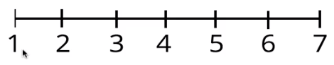
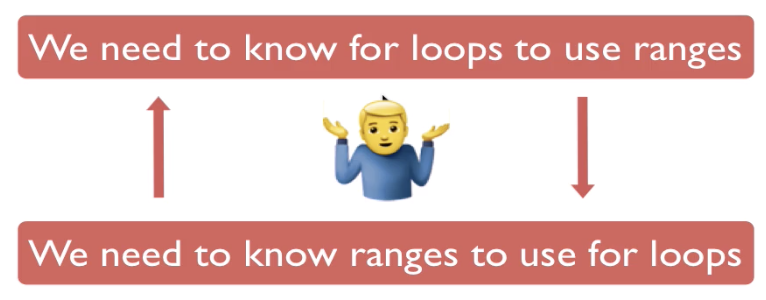

# Loops

## Objectives

- Understand what loops are and how/why they are useful.
- Learn what an iterable object is. 
- Use _for_ and _while_ loops to iterate over ranges and strings.
- Learn how to control exiting a loop.

### _for_ loops

_for_ loops are useful when you have a collection of data. Something you can iterate over or loop through. Using a for loop you can iterate through things like _lists_, _strings_, or a _range_.

#### Syntax

In Python, _for_ loops are written like this:

```
for item in iterable_object:
    # do something with item
```

- an **iterable object** is some kind of collection of items, for instances: a list of numbers, a string of characters, a range etc.
- _item_ is a new variable that can be called whatever you want.
- _item_ references the current position of our **iterator** within the _iterable_. It will iterate over (run through) every item of the collection and then go away when it has visited all items.

##### _for_ loops with ranges

Let's print numbers 1-7 using our knowledge of looping through ranges.

```
for number in range(1,8):
    print(number)
```



The output of this will look like this: 

```
1
2
3
4
5
6
7
```
 
 ### Ranges

 Ranges exist on their own, but they're typically not used outside of **for** loops. Conversely, **for** loops typically don't exist with out making use of **ranges**.

 

 [Link to Range documentation](https://docs.python.org/3.3/library/stdtypes.html#ranges)

 > The **range** type represents an immutable sequence of numbers and is commonly used for looping a specific number of times in **for** loops.

 If we just want to print numbers we can simply iterate over a **range**. 

 A **range** is just a slice of the number line. 

 

 Python ranges come in multiple forms:

 **range(7)** gives you itegers from 0 thru 6 (shown) _Count starts at 0 and is exclusive_

 **range(1,8)** will give you integers from 1 to 7 _Two parameters are (start,end)_

 The last two types of ranges us a third parameter called the "step", meaning how many to skip. Also, which way to count, up + or down -.

 **range(1,10,2)** will give you odds from 1 to 10 

 **range(1,0,-1)** will give you integers from 7 to 1

