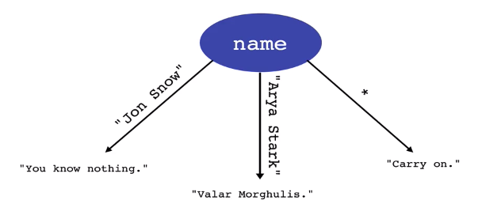

# Section 8: Boolean and Conditional Logic

## Objectives

* Learn how to get user input in Python (already did that)
* Learn about "Truthiness"
* Learn how to use comparison operators to make a basic program

# Conditional Statements

## Conditional Checks 

Conditional logic using *if* statements represents different paths a program can take based on some type of comparison of input.

This is pseudo code to represent some conditional logic.

```
if some condition is True:
    do something
elif some other condition is True:
    do something
else:
    do something
```

Here is a similar example written in Python. 

```
if name == "Arya Stark":
    print("Valar Morghulis")
elif name == "Jon Snow":
    print("You know nothing")
else:
    print("Carry on")
```



In Python you can do a standalone *if* statement without a followup *else* statement. The example code below will follow the "Arya Stark" line from the flowchart above unless name doesn't equal "Arya Stark". If name equals a different value nothing will happen.

```
if name == "Arya Stark":
    print("Valar Morghulis")
```

> **NOTE:** Indentation in the if/elif/else statements does matter. Python expects the lines after the statements to be indented 4 spaces.

> **NOTE:** The colons are required in all if/elif/else statements. Otherwise the syntax is invalid.

> **NOTE:** You can have as many elif/else if statements in the middle of an if statement. Only one *else* is allowed and it has to be at the end of the conditional statement block. 

## Truthiness (Falsyness?)

In Python, all conditional checks resolve to **True** or **False**

```
x = 1 
x is 1 # True (this is a "truthy" expression)
x is 0 # False (this is a "falsy" expression)
```

We can call values that will resolve to True "**truthy**" or values that will resolve to False as "**falsy**".

Besides False conditions checks, other things that are naturally falsy include: empty objects, empty strings, *None*, and zero.

You can take advantage of this knowledge within conditional statements. Here's a real use case for this knowledge.

In the example below we prompt the user for their favorite animal. If the value entered by the user is empty then it will skip to the else block and print "You did not enter a value." whereas if the user enters a value then the program will print "{animal} is my favorite too!".

```
animal = input("Enter your favorite animal: ")

if animal:
    print(f"{animal} is my favorite too!")
else:
    print("You did not enter a value.")
```

## Comparison Operators

Here is a list of comparison operators. In the examples **a = 1** and **b = 1**

|Operator|Description|Example|
 |--|--|--|
 |==|Truth if **a** has the same value as **b**|a == b # True|
 |!=|Truthy if **a** does **NOT** have the same value as **b**|a != b # False|
 |> <br> >|Truthy if **a** is greater than **b** <br> Truthy if **a** is less than **b**|a > b # False <br> a < b # False|
 |>= <br> <=|Truthy if **a** is greater than or equal to **b** <br> Truthy if **a** is less than or equal to **b**|a >= b # True <br> a <= b # True|
 
 ## Logical Operators

 Logical operators connect multiple comparison operators.

 |Operator|Description|Example|
 |--|--|--|
 |and|Truthy if both **a** AND **b** are true <br> (logical conjunction)|**if** a **and** b:<br>    print(c)|
 |or|Truthy if either **a** OR **b** are true <br> (logical disjunction)|**if** am_tired **or** is_bedtime:<br>    print("go to sleep")|
 |not|Truthy if the opposite of **a** is true <br> (logical negotiation)|**if not** is_weekend:<br>    print("go to work")|

(AND example) Check if age is between 2 and 8:

 ```
age = 6

if age > 2 and age < 8:
    print("You pay the children's price!")
 ```

(OR example) Check if the person lives in california based on city entered. 

```
city = input("where do you live?")

if city == "los angeles" or city == "san francisco":
    print("You live in California!")
else:
    print("You live somewhere else!")
```

(NOT example) check if person is _not_ a child or senior.

```
age = 21

# 2-8 $2 ticket
# >65 $5 ticket
# all others $10 ticket

if not ((age >= 2 and age <=8) or age >=65):
    print ("You pay $10")

```

## is vs. "==" 

In python, "==" and "is" are very similar comparators, however they are not the same.

```
a = 1
a == 1 # True
a is 1 # True
```

```
a = [1,2,3] # a list of numbers
b = [1,2,3]
a == b # True
a is b # False
```

```
c = b
b is c # True
```

== checks values
_is_ checks if the two items are the same thing in _memory_

